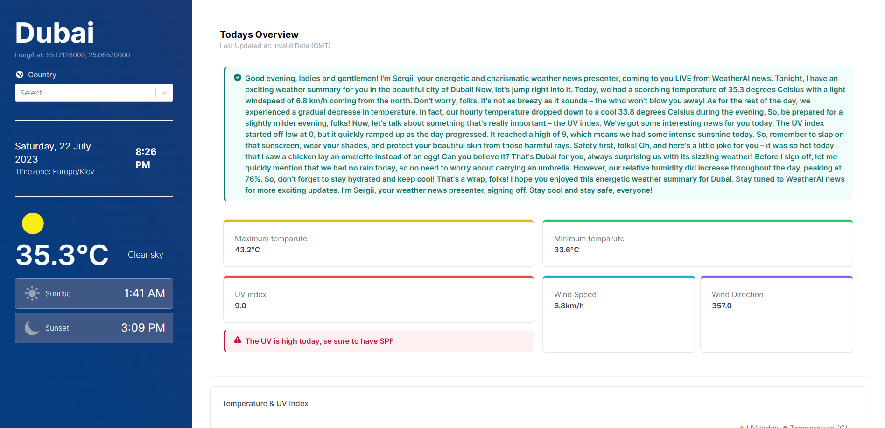
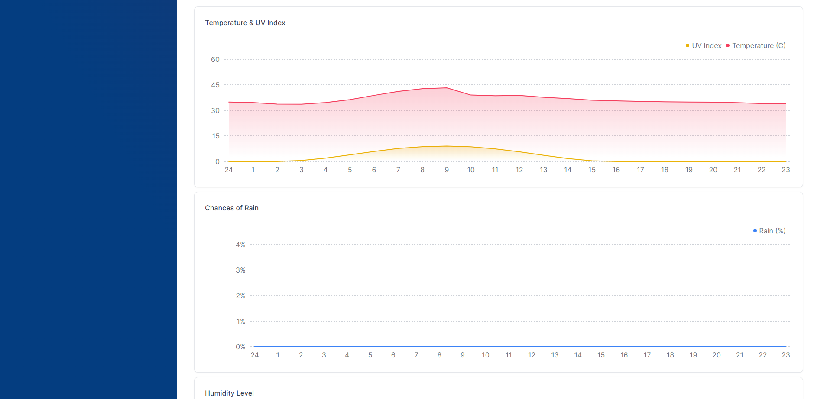

This is weather app build with OpenAI, NextJS 13, Tailwind, Tremor 3, StepZen, GraphQL. The main idea to provide user with breif weather introduction as if it was created by some news.

## Getting Started

```bash
cp .env.local.example .env.local
```

populate variables with own StepZen and OpenAI API keys

Run the development server:

```bash
npm run dev
npm run start:stepzen
```

Open [http://localhost:3000](http://localhost:3000) with your browser to see the result.

## Deploy

The app is not deployed to since it's using paid plan for OpenAI

## UI



